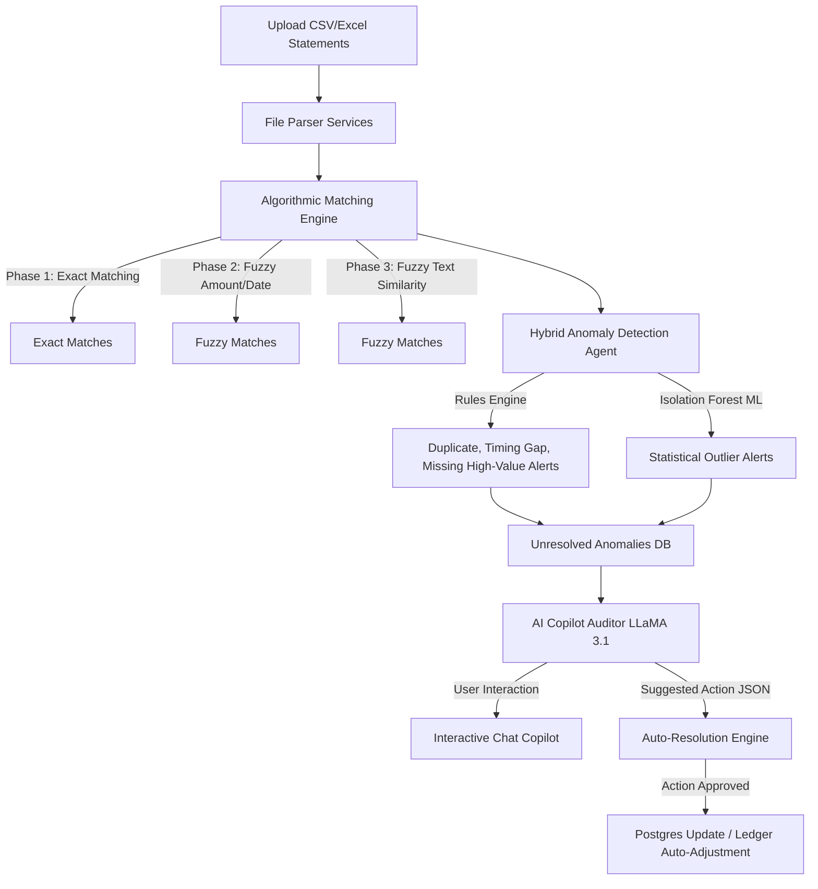

# ReFinely Enterprise
> **Agentic AI Financial Reconciliation & Audit Platform**

[](https://react.dev/)
[](https://fastapi.tiangolo.com/)
[](https://www.postgresql.org/)
[-F34F29?logo=meta&logoColor=white&style=flat-square)](https://groq.com/)
[](https://www.docker.com/)
[](https://opensource.org/licenses/MIT)

---

## 📖 Overview
**ReFinely Enterprise** is a high-performance, multi-tenant SaaS application designed to automate corporate bank-to-ledger reconciliation. By combining high-speed deterministic algorithms, unsupervised Machine Learning (Isolation Forest), and GenAI Auditors (LLaMA 3.1 via Groq), ReFinely simplifies finding financial transaction anomalies—such as duplicate ledger postings, timing delays, missing high-value statements, or statistical outliers. It also provides an automated correction engine to update records directly.

---

## ✨ Features
- 👥 **Multi-Tenant Organization Management**: Manage separate bank account listings, configurations, and reconciliations across distinct organizations.
- ⚡ **Three-Phase Match Pipeline**:
  - **Phase 1 (Exact)**: Matches transactions based on exact amount and date pairings using $O(N)$ lookup dictionaries.
  - **Phase 2 (Fuzzy Amount/Date)**: Matches pairs with a $1\%$ amount tolerance and a $3$-day date gap.
  - **Phase 3 (Fuzzy Description)**: Matches items using text similarity ratios calculated by `SequenceMatcher` ($\ge 90\%$).
- 🤖 **Hybrid Anomaly Agent**:
  - Detects duplicate posts, timing differences (posting to wrong financial period), and missing high-value transfers.
  - Runs **Isolation Forest** (Scikit-Learn) statistical analysis on amount and day-of-month parameters to detect unusual account usage, backed by cold-start protection logic.
- 💬 **AI Copilot Auditor**: Conversational chat interface constrained to unresolved anomalies to advise accountants and recommend resolutions.
- 🛠️ **Auto-Correction Engine**: Click-to-apply database operations (e.g., auto-creating ledger entries, deleting verified duplicates) recommended by the AI.
- 📊 **"Turnitin-Style" Excel Export**: Generates color-coded Excel audit sheets (Green = Safe, Yellow = Resolved, Red = Critical) with warning notes attached to spreadsheet cell comments.

---

## 📐 System Architecture Flow


---

## 📂 Project Structure
```
refinely-enterprise/
├── backend/                 # Python FastAPI Application
│   ├── app/
│   │   ├── api/             # API Router Entrypoints & Controllers
│   │   ├── core/            # Database Session & Security Configuration
│   │   ├── models/          # SQLAlchemy Database Models
│   │   ├── schemas/         # Pydantic Schemas (Request/Response validation)
│   │   └── services/        # Matching Engine, Outlier ML, & LLM Copilot
│   ├── Procfile             # Heroku deployment configuration
│   └── requirements.txt     # Python backend dependencies
│
├── frontend/                # React TypeScript Application
│   ├── src/
│   │   ├── components/      # Reusable UI Layouts & Components
│   │   ├── contexts/        # Authentication & State Management
│   │   ├── pages/           # Pages (Dashboard, Copilot, Reconciliation Details)
│   │   ├── services/        # API Axios wrapper functions
│   │   └── types/           # TypeScript Types
│   ├── tailwind.config.js   # Style Utilities Config
│   ├── vercel.json          # Vercel deployment configuration
│   └── package.json         # Node dependencies
│
└── infra/                   # Infrastructure configuration
    └── docker-compose.yml   # Local database (Postgres) configuration
```

---

## 🚀 Getting Started

### 📋 Prerequisites
- **Python**: `3.11` or higher
- **Node.js**: `v18` or higher (with `npm`)
- **Docker**: For running PostgreSQL database container locally

---

### 1. Database Setup (Docker)
Ensure Docker is running and launch the PostgreSQL container:
```bash
cd infra
docker-compose up -d
```
*This starts Postgres on `localhost:5432` with user `refinely_user` and password `refinely_secret`.*

---

### 2. Backend Setup
1. Navigate to the backend directory and create a virtual environment:
   ```bash
   cd ../backend
   python -m venv venv
   ```
2. Activate the virtual environment:
   - **Windows (CMD)**: `venv\Scripts\activate`
   - **Windows (PowerShell)**: `.\venv\Scripts\activate`
   - **macOS/Linux**: `source venv/bin/activate`
3. Install dependencies:
   ```bash
   pip install -r requirements.txt
   ```
4. Create a `.env` configuration file in the `backend/` directory:
   ```env
   # Database Configurations
   DB_USER=refinely_user
   DB_PASSWORD=refinely_secret
   DB_HOST=localhost
   DB_PORT=5432
   DB_NAME=refinely_db

   # Security Token
   SECRET_KEY=your-super-secret-key-change-in-production
   
   # AI Integrations
   GROQ_API_KEY=your_groq_llama_api_key_here
   
   # Google OAuth Integration (Optional)
   GOOGLE_CLIENT_ID=your_google_client_id_here
   ```
5. Launch the backend API development server:
   ```bash
   uvicorn app.main:app --reload --port 8000
   ```
   *The interactive Swagger API documentation will be available at `http://localhost:8000/docs`.*

---

### 3. Frontend Setup
1. Navigate to the frontend directory:
   ```bash
   cd ../frontend
   ```
2. Install npm dependencies:
   ```bash
   npm install
   ```
3. Create a `.env` configuration file in the `frontend/` directory:
   ```env
   VITE_API_URL=http://localhost:8000/api/v1
   VITE_GOOGLE_CLIENT_ID=your_google_client_id_here
   ```
4. Run the React application:
   ```bash
   npm run dev
   ```
   *The React web interface will be running at `http://localhost:5173`.*

---

## 🛠️ Matching & Machine Learning Details

### Matching Complexities
Rather than checking elements using basic nested loops ($O(N^2)$ complexity), ReFinely utilizes an **Index Map lookup** ($O(N)$ complexity) in the exact phase:
- It processes transactions into a dictionary mapped by `(amount, transaction_date)`.
- It executes exact check operations instantly in $O(1)$ lookup time, leaving only outliers for the secondary fuzzy phases.

### ML Outlier Detection (Isolation Forest)
- **Features Used**: `[abs(amount), transaction_date.day]`.
- **Anomalies contamination rate**: Configured at `0.02` ($2\%$).
- **Cold Start Guardrail**: The ML model requires a baseline to learn statistical distributions. The system enforces a guardrail requiring at least 50 historical transactions (`MIN_TRANSACTIONS_FOR_ML = 50`) before running ML to avoid false positives.

---

## 📄 License
This project is licensed under the MIT License - see the [LICENSE](LICENSE) file for details.
